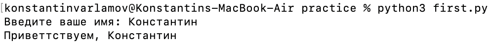
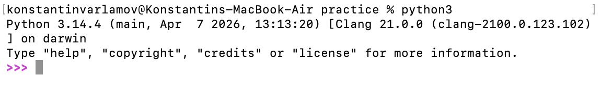

# Задание 5. Практика:

### Текст программы
```py
class User:
    name = "Unknown"


name = input("Введите ваше имя: ")

user1 = User()
user1.name = name

print(f"Приветтствуем, {user1.name}")
```

### Вывод:


### Среда:
