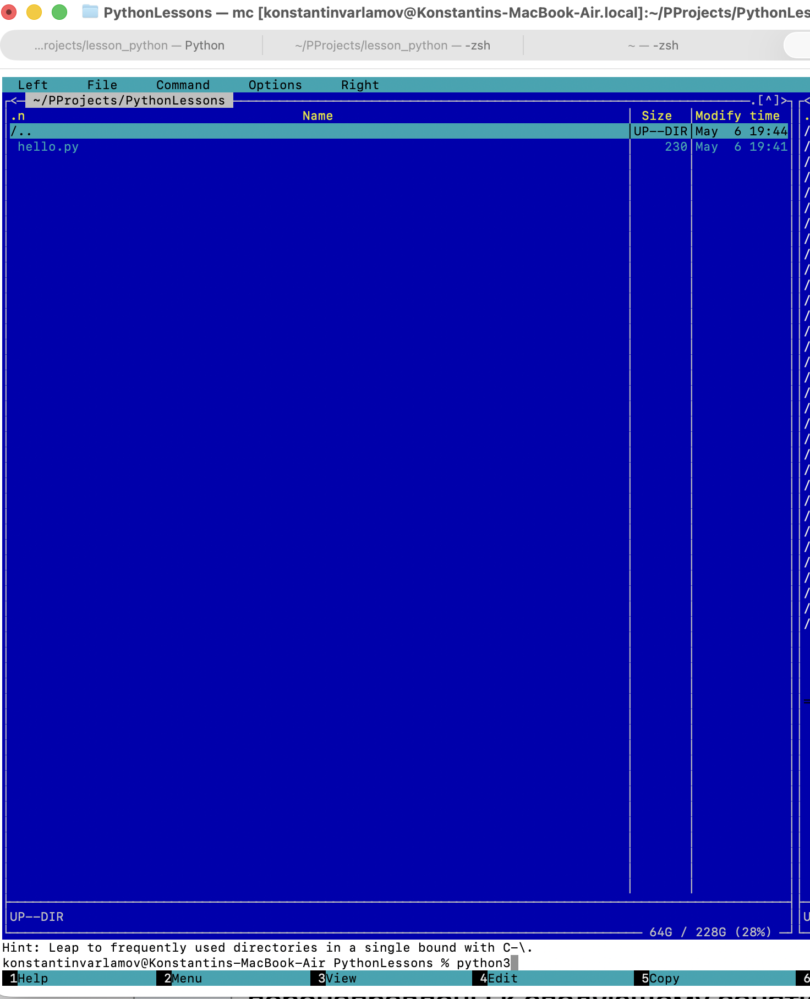
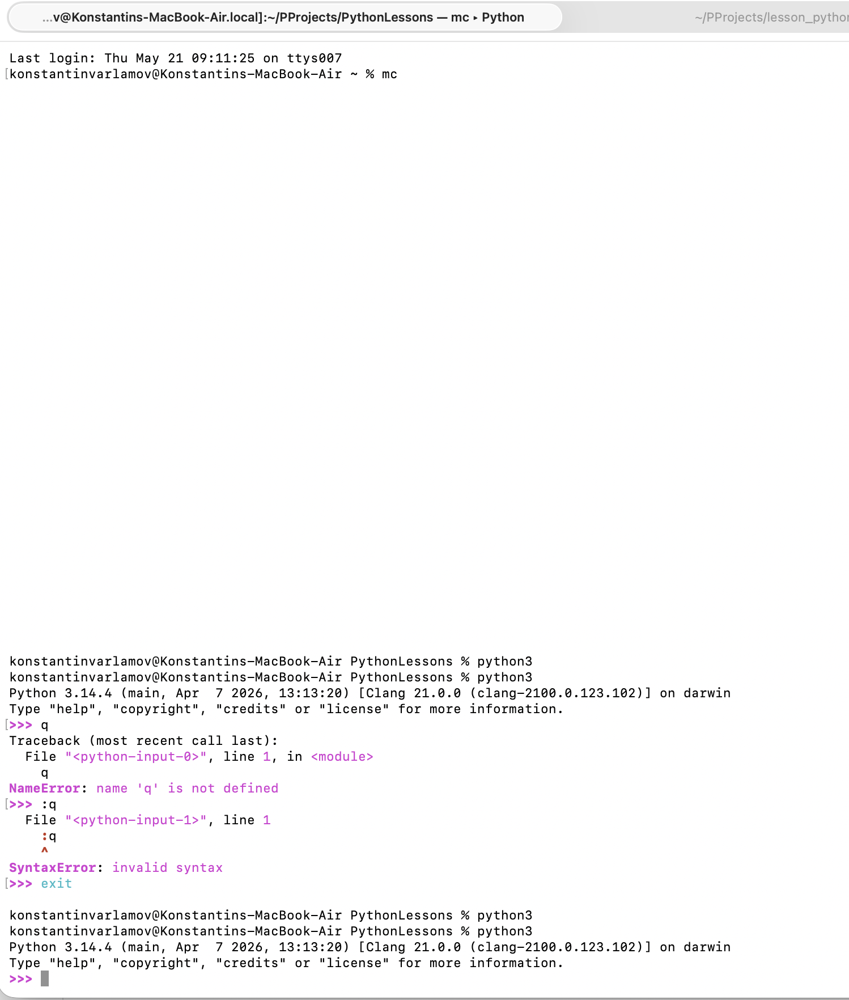

# Задание по Far Manager.
Поскольку mac не поддерживает far, взял его альтернативу midnight-commander.
Установил через brew.
Работает через стандартный терминал, там же осуществляется запуск по команде **mc**

Скриншот из рабочей папки, подготовка к запуску python

При выполнении команды **python3** происходит запуск python в терминале
